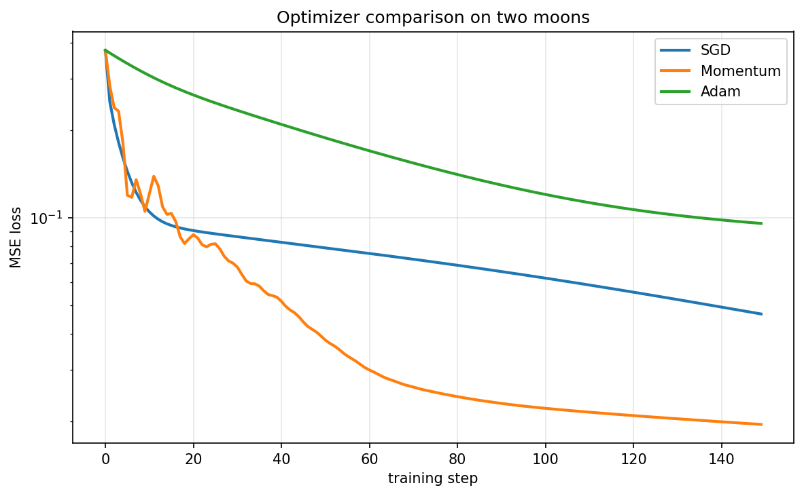

# Phase 1 — Autograd Engine

A tiny automatic differentiation engine built from scratch in pure Python.
No PyTorch, no TensorFlow, no NumPy. Just Python and the chain rule.

This is the mathematical heart of every neural network. Everything that
comes later (optimizers, tensors, transformers) is built on top of the
ideas implemented here.

---

## What's inside

| File | Purpose |
|---|---|
| `engine.py` | The `Value` class: a number that remembers how it was created and can compute its own gradient. |
| `nn.py` | `Neuron`, `Layer`, `MLP` — the architecture layer built on top of `Value`. |
| `optim.py` | `SGD`, `Momentum`, `Adam` — the update rules that turn gradients into learning. |
| `viz.py` | Graphviz-based visualization of the computational graph. |
| `nn_viz.py` | Matplotlib-based diagram of a neural network's architecture. |

---

## Quick example

```python
from engine import Value

a = Value(2.0)
b = Value(-3.0)
c = a * b + a.tanh()
c.backward()

print(a.grad)   # -3 + (1 - tanh(2)^2)
print(b.grad)   # 2.0
```

---

## End-to-end training

```bash
python examples/train_moons.py
```

Trains an MLP (2 → 8 → 8 → 1) on the two-moons dataset, which is **not**
linearly separable. Loss goes from 1.05 to 0.02 in 500 steps. The decision
boundary comes out curved, proving that the hidden layers are contributing
nonlinearity — something a linear model could never do.


---

## Optimizer comparison

```bash
python examples/compare_optimizers.py
```

Trains the same MLP (2 → 6 → 6 → 1) on the same data with SGD, Momentum,
and Adam. Same steps, same initialization, only the update rule changes.



| Optimizer | lr    | Final loss (150 steps) |
|-----------|-------|------------------------|
| SGD       | 0.10  | 0.0468                 |
| Momentum  | 0.05  | 0.0195                 |
| Adam      | 0.01  | 0.0210                 |

Momentum beat Adam here. That is not a bug: Adam's canonical learning
rate is `0.001`, chosen for large problems. On this small task, the
default is not the right one — see the sweep below.

---

## Learning rate sweep

```bash
python examples/hyperparameter_sweep.py
```

The same Adam optimizer, the same data, the same number of steps.
Only the learning rate changes:

| Adam lr | Final loss (150 steps) |
|---------|------------------------|
| 0.001   | 0.1041                 |
| 0.003   | 0.0696                 |
| 0.010   | 0.0231                 |
| 0.030   | 0.0118                 |

The loss drops monotonically as the learning rate increases. This is
not the shape you would see on a large problem, where a high learning
rate causes divergence. Here, the problem is small and well-conditioned
enough that higher is simply better — up to a point this sweep does not
reach.

The lesson is not "use a high learning rate". It is that **canonical
values from papers assume a problem scale this toy example does not
have**. There is no universal learning rate, and the only way to find
the right one is to sweep it.

---

## Visual walkthrough

```bash
python examples/walkthrough_visual.py
```

Generates `assets/walkthrough.html`. Open it in a browser to see the
computational graph grow step by step: a single `Value`, then two inputs,
then a multiplication, then an addition where one node feeds two paths,
and finally the backward pass with gradients filled in.

The last panel is the most important: `a.grad` is the **sum** of its two
paths, which is what `+=` in `_backward` guarantees.

---

## Gradient flow

```bash
python examples/gradient_evolution.py
```

Trains a small MLP on `sin(x0) * cos(x1)` and plots two things:

- The loss curve over training (left).
- The gradient L2 norm per layer over training (right).

A healthy run shows all layer curves decaying smoothly toward a small
value. A curve collapsing to zero indicates vanishing gradients; one
that grows indicates instability.

---

## Tests

```bash
python tests/run_all.py
```

- `test_engine.py` — verifies every operation against numerical gradients.
- `test_nn.py` — verifies the architecture layer: dimensions, parameter counts, forward/backward.
- `test_optim.py` — verifies SGD's update rule and the ordering contract.

All tests use central differences to check gradients independently of the
engine itself.

---

## Documentation

For the design rationale behind each file, see `docs/`:

- [`docs/engine.md`](docs/engine.md) — why `Value` is the way it is.
- [`docs/nn.md`](docs/nn.md) — why `Module`, `Neuron`, `Layer`, `MLP`.
- [`docs/optim.md`](docs/optim.md) — why `zero_grad` and `step` are separate.

Each document explains the *why*, not the *what*. The code already says
what it does.

---

## Requirements

- Python 3.10+
- `graphviz` (Python package) and the Graphviz `dot` binary (for `viz.py`).
- `matplotlib` (for `nn_viz.py` and the training plots).
- `numpy` (for dataset generation).

```bash
pip install graphviz matplotlib numpy
```

---

## What Phase 2 will add

- A tensor-based `Value` (numpy backend) to replace the scalar engine.
- Same API, ~100× faster training.
- Gradient verification against `torch.autograd`.

Phase 1 stops at three optimizers on scalar values, on purpose. The scalar
engine is the clearest possible expression of what autograd does. Once the
ideas are clear, the tensor version becomes a matter of writing faster
arithmetic, not new math.