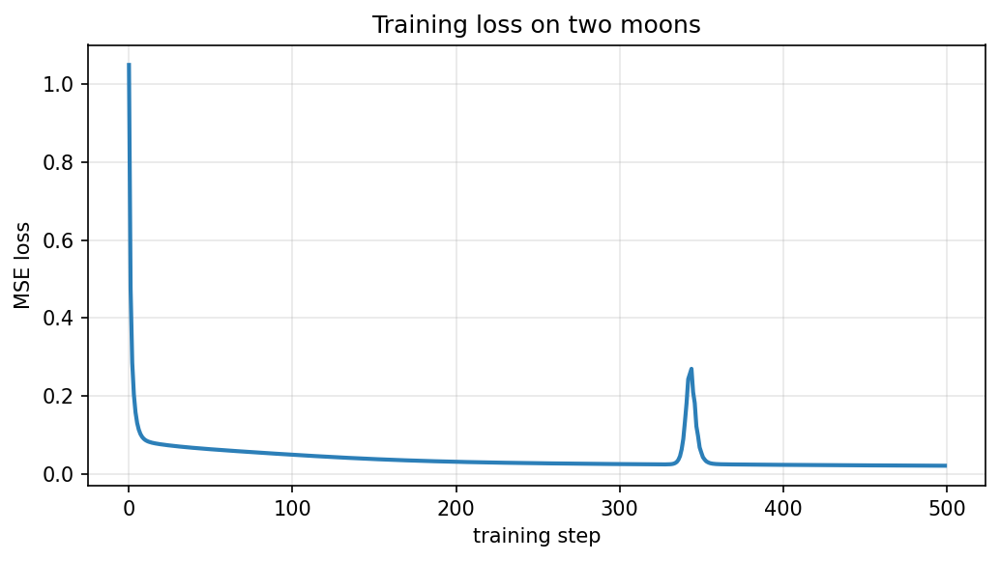
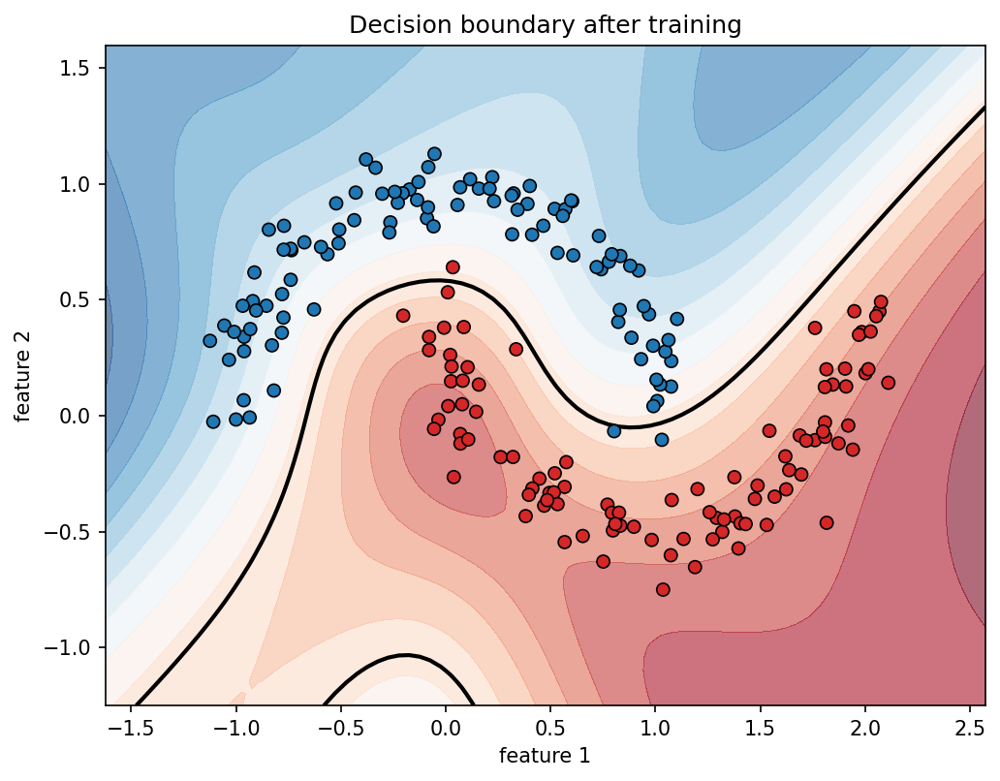

# Phase 1 — Autograd Engine

A tiny automatic differentiation engine built from scratch in pure Python.
No PyTorch, no TensorFlow, no NumPy. Just Python and the chain rule.

This is the mathematical heart of every neural network. Everything that
comes later (optimizers, tensors, transformers) is built on top of the
ideas implemented here.

---

## What's inside

| File | Purpose |
|---|---|
| `engine.py` | The `Value` class: a number that remembers how it was created and can compute its own gradient. |
| `nn.py` | `Neuron`, `Layer`, `MLP` — the architecture layer built on top of `Value`. |
| `optim.py` | `SGD` — the update rule that turns gradients into learning. |
| `viz.py` | Graphviz-based visualization of the computational graph. |
| `nn_viz.py` | Matplotlib-based diagram of a neural network's architecture. |

---

## Quick example

```python
from engine import Value

a = Value(2.0)
b = Value(-3.0)
c = a * b + a.tanh()
c.backward()

print(a.grad)   # -3 + (1 - tanh(2)^2)
print(b.grad)   # 2.0
```

---

## End-to-end training

```bash
python examples/train_moons.py
```

Trains an MLP (2 → 8 → 8 → 1) on the two-moons dataset, which is **not**
linearly separable. Loss goes from 1.05 to 0.02 in 500 steps. The decision
boundary comes out curved, proving that the hidden layers are contributing
nonlinearity — something a linear model could never do.




---

## Visual walkthrough

```bash
python examples/walkthrough_visual.py
```

Generates `assets/walkthrough.html`. Open it in a browser to see the
computational graph grow step by step: a single `Value`, then two inputs,
then a multiplication, then an addition where one node feeds two paths,
and finally the backward pass with gradients filled in.

The last panel is the most important: `a.grad` is the **sum** of its two
paths, which is what `+=` in `_backward` guarantees.

---

## Tests

```bash
python tests/run_all.py
```

- `test_engine.py` — verifies every operation against numerical gradients.
- `test_nn.py` — verifies the architecture layer: dimensions, parameter counts, forward/backward.
- `test_optim.py` — verifies SGD's update rule and the ordering contract.

All tests use central differences to check gradients independently of the
engine itself.

---

## Documentation

For the design rationale behind each file, see `docs/`:

- [`docs/engine.md`](docs/engine.md) — why `Value` is the way it is.
- [`docs/nn.md`](docs/nn.md) — why `Module`, `Neuron`, `Layer`, `MLP`.
- [`docs/optim.md`](docs/optim.md) — why `zero_grad` and `step` are separate.

Each document explains the *why*, not the *what*. The code already says
what it does.

---

## Requirements

- Python 3.10+
- `graphviz` (Python package) and the Graphviz `dot` binary (for `viz.py`).
- `matplotlib` (for `nn_viz.py` and the training plots).
- `numpy` (for dataset generation).

```bash
pip install graphviz matplotlib numpy
```

---

## What Phase 2 will add

- Momentum and Adam optimizers.
- A comparison of SGD, Momentum, and Adam on the same task.
- Gradient verification against `torch.autograd`.

Phase 1 stops at SGD on purpose. Every optimizer is judged against SGD;
you cannot evaluate Momentum or Adam without knowing what plain SGD does.